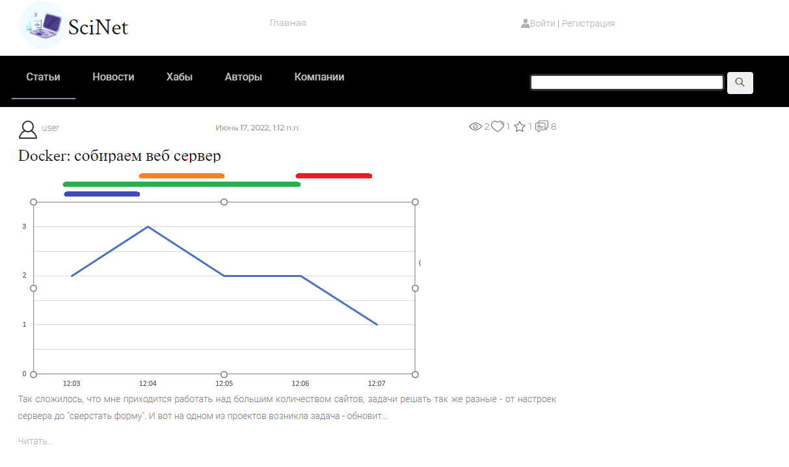

# Проект по курсу обучения Agile методологии
## Сайт для обучения "SciNet"
  

## Командная разработка по методологии Agile:Scrum
___

### Используемый стек технологий:
* Python 
* Django
* Celery
* Docker

### Запуск проекта:
1. Клонировать репозиторий `https://github.com/0zzzzz/scinet.git`
2. Перейти в папку с проектом   
3. Запустить проект командой `docker-compose up --build`
4. Проект доступен по адресу в браузере `http://127.0.0.1:8000`
